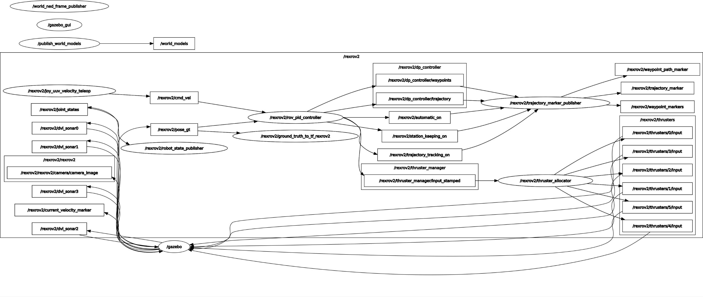

This is the repository for the rumarino Task Module. Definitions ofthe State machines  and mission logic for competition.


## Message Dependencies
 - [Zed Interface](https://github.com/stereolabs/zed-ros-interfaces): This messages descriptions are used for the the Zed-ROS-Wrapper that interacts with the Camera ROS node. The Purpose is to have a definition of the Messages for usiing them in a subscriber in the Task Executions.

-  [IMU and DVL](https://github.com/Rumarino-Team/Hydrus/tree/main/jetson-tx2/catkin_ws/src/nav_sensors): The Hydrus repository was included in the dependencies for interacting with the DVL and IMU definitions. In the case of the IMU there is no message definition, the topic outputs Float numbers.

- [uuv_control_msgs](https://github.com/uuvsimulator/uuv_simulator/tree/master/uuv_control/uuv_control_msgs): This Package define the Servers for interacting with the control system of the submarine.


### Explanation of the Messages:

 Zed Interface have the following messages:

 - ObjectsStamped.msg

 - RGBDSensors.msg

 - PlaneStamped.msg

 - Marker.msg

 - nav_msgs/Odometry.msg


 The DVL have the following Messages:

  - DVL_MSG.msg

The IMU:


The topics for each Message are the following:

In the case of the Zed Camera you can check in this [file](https://github.com/Rumarino-Team/Vision-Zed-Ros-Wrapper/blob/master/zed_nodelets/src/zed_nodelet/src/zed_wrapper_nodelet.cpp) how its defined the topics for each Message. Nevetheless here it is :V

 ```
 ObjectsStamped: "obj_det/objects"

 RGBDSensors: "rgbd_sens"

 PlaneStamped: "plane"

 Marker.msg: "plane_marker"

 ```

DVL topics are the following:


```
DVL_Message: "/wayfinder/topic_name"
```


IMU Topics:

```
'/hydrus/IMU/yaw' : FLOAT32
'/hydrus/IMU/pitch': FLOAT32
'/hydrus/IMU/roll' : FLOAT32
```


UUV Control Services:

- InitWayPoint

- From Files

- Hold.srv


## More Description about the Services.

The services are defined in the uuv_simulator_package. In here is where is defined all the control system of the submarine.
For our case the mentioned services are defined in this [file](https://github.com/uuvsimulator/uuv_simulator/blob/master/uuv_control/uuv_trajectory_control/src/uuv_control_interfaces/dp_controller_local_planner.py).


### Run the Task Module with the simulation


In order to use it with the simulation you will need to run the Dockerfile.


TODO: Currently our implementation on Hydrus in the uuv simulator is under development but meanwhile we can use the RexRov2 simulation


### Connecting the Sensor Messages to the Control System

The uuv_simulator have the following nodes and topics structures when using the `rov_pid_controller.py` node. 




What interest us is to replace the Odometer data that is defined in here as `/rexrov2/pose_gt`.


What information we will implement for this is to be discussed. What needs the control system is a `Nav_msgs/Pose.msg` Neither the DVL or the IMU give is that infomation. Gladly the Zed camera in his node gives us that exact Message. Something that we could implement is to take the message of the camera to extract the Positional Tracking information and replace the other data with the more speciallyze sensors in the same output


TODO:
- Keep completing and fixing documentation
- Run the StateMachines in the simulation
- Complete the check compare_poses
